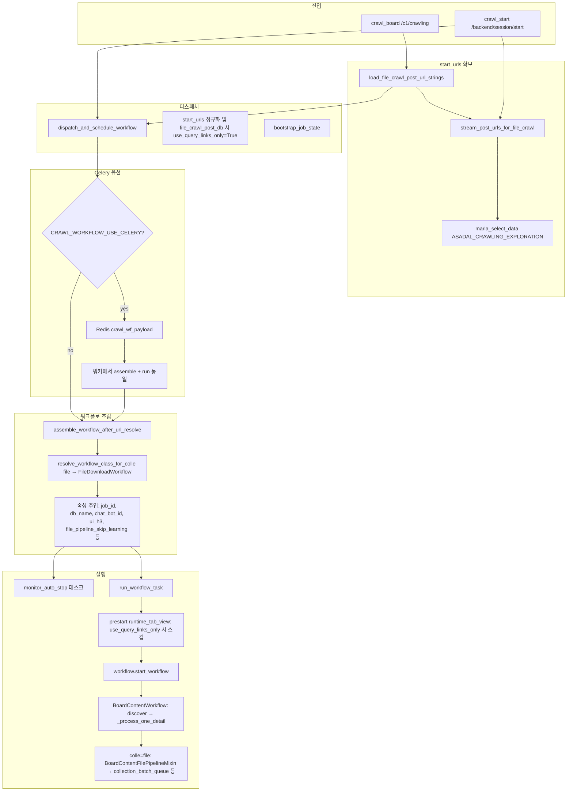

# 파일 크롤링(`colle=file`) 함수 호출 플로우

이 문서는 **`colle=file`**(게시판 상세에서 첨부 수집·다운로드) 요청이 들어온 뒤, 백엔드에서 **어떤 함수가 어떤 순서로 호출되는지**를 코드 기준으로 정리합니다.

저장 경로와 FileUpload 전달 규칙은 [FILE_STORAGE_FLOW.md](./FILE_STORAGE_FLOW.md)를 함께 참고합니다.

---

## 0. 파일 분류 기본 동작과 보정 전용 모드

- 일반 `colle=file` 크롤링은 탐색/다운로드/학습 흐름을 그대로 두고, 파일 저장 직전의 `insert_into_learn_list(...)`에서만 파일 분류를 결정한다.
- 파일 분류 저장 규칙은 `LEARN_LIST.cate1 = 파일학습 root 코드`, `LEARN_LIST.cate2 = 파일학습 바로 아래의 게시판 cate2 동명 분류 코드`이다. 게시판 cate1은 실제 파일 분류 계층에는 쓰지 않는다.
- 저장/학습되는 신규 파일은 게시판 상세/메타의 cate2 분류명 또는 분류코드를 받아 위 규칙으로 저장한다.
- 프론트에서 `file_category_mode=category_only` 또는 `file_category_update_only=true`를 보내면 `backend.shared.crawl_start._crawl_file_worker`가 실제 다운로드/학습을 시작하지 않고 기존 분류 동기화만 수행한 뒤 완료 상태를 보낸다.
- 이 전용 모드는 `crawling_period01_dev.htm`, `crawling_period02_svc.htm`의 `파일 분류 보정 > 분류값만 업데이트` 옵션에서 사용한다.

---

## 1. 범위와 전제

- **워크플로 클래스**: `colle=file` 일 때 `backend.shared.pre_explored_url.resolve_workflow_class_for_colle("file")` → **`FileDownloadWorkflow`** (`backend/file/file_download_workflow.py`).  
  - `FileDownloadWorkflow` = `BoardContentFilePipelineMixin` + `BoardContentWorkflow` 상속 → 본문 워크플로의 **상세 페이지 루프**는 그대로 타고, **`colle=="file"` 분기**에서 첨부 메타를 **파일 전용 큐**로 넘깁니다.
- **`IntegratedWorkflow`**: `colle`이 `board` / `file`이 **아닐 때**만 `workflow_dispatch_assembly`에서 선택됩니다. **일반적인 프론트 `colle=file` API 경로에서는 사용되지 않습니다.**

---

## 2. 진입점 (두 갈래)

### 2-A. 권장: `POST …/c1/crawling` (게시판 라우터)

| 단계 | 모듈·심볼 | 역할 |
|------|-----------|------|
| 1 | `backend.board.board_endpoints.crawl_board` | JSON 바디 파싱, 기본 `colle` 보정 |
| 2 | 동일, `colle == "file"` 분기 | 헤더 크롤·사이트맵 **생략** |
| 3 | `backend.shared.file_crawl_post_urls.load_file_crawl_post_url_strings` | `ASADAL_CRAWLING_EXPLORATION`에서 `type='post'` URL만 로드 |
| 4 | `data["start_urls_override"]`, `data["start_urls_override_source"] = "file_crawl_post_db"` 설정 | 디스패처가 그대로 소비 |
| 5 | `asyncio.create_task(dispatch_and_schedule_workflow(..., header_response=None))` | 비동기 디스패치 |
| 6 | 즉시 `{"status":"accepted","job_id":...}` 응답 | 본 작업은 백그라운드 |

### 2-B. 레거시/세션: `POST …/backend/session/start`

| 단계 | 모듈·심볼 | 역할 |
|------|-----------|------|
| 1 | `backend.shared.crawl_start.crawl_start` | Redis 메타·상태 초기화, `job_id` 수락 |
| 2 | `asyncio.create_task(_crawl_file_worker)` | 백그라운드 워커 |
| 3 | `_crawl_file_worker` → `_prepare_crawl` | DB에서 URL 채움 |
| 4 | `_prepare_crawl` 내부: `colle=="file"` 이면 `stream_post_urls_for_file_crawl`, 아니면 `stream_asadal_urls_from_db` | 파일 모드도 LEARN_LIST **`url_pattern`의 include**로 `resolve_cate_for_detail_url` 통과분만 사용한다. 다만 include가 비면 board와 동일하게 exploration `post` 전체를 `start_urls`로 사용한다. |
| 5 | `_schedule_and_monitor` → `dispatch_and_schedule_workflow` | 2-A와 이후 동일 |

---

## 3. 전체 호출 흐름 (요약 다이어그램)



---

## 4. `dispatch_and_schedule_workflow` 상세

**파일**: `backend/shared/crawl_dispatcher.py`  
**함수**: `dispatch_and_schedule_workflow(data, background_tasks, header_response=None)`

대략적 순서:

1. **`job_id` 검증** — 없으면 400.
2. **동일 `job_id` 실행 중** — `crawler_state.workflow_tasks` 또는 Celery Redis 키로 판단.  
   - 이미 돌고 있고 `colle`이 다르면 409.
3. **`start_urls` 구성**  
   - `start_urls_override` 리스트가 있으면 URL 정규화(`ensure_url_scheme`).  
   - `start_urls_override_source == "file_crawl_post_db"` 인 경우 **별도 분기 없이** `start_urls = normalized_override` (sitemap 전개 없음).
4. **`file_crawl_post_db` 보정**  
   - `start_urls`가 있으면 **`use_query_links_only = True`** 로 고정 → 이미 **게시물(detail) URL**이므로 목록→상세 확장·깊이 탐색을 피함.
5. **선택: `contents[0]`의 `/bbs/{id}` 로 `start_urls` 필터** — URL 패턴 매칭 시 일부만 남김(파일 크롤에서도 동일 로직이 타면 적용됨).
6. **`resolve_db_name` / `resolve_chat_bot_id`** — `data`에 다시 반영.
7. **`start_urls` 0건** — `contents`도 비어 있으면 400; 아니면 422 + SSE terminal 등.
8. **`bootstrap_job_state`**
9. **Celery 분기** (`CRAWL_WORKFLOW_USE_CELERY`)  
   - 켜져 있으면 Redis에 payload 저장 후 Celery 태스크만 enqueue하고 종료.  
   - 워커 쪽에서 동일하게 `assemble_workflow_after_url_resolve` + `run_workflow_task` 호출(구현은 Celery consumer 쪽 모듈).
10. **인프로세스 경로**  
    - `assemble_workflow_after_url_resolve(...)`  
    - `crawler_state.workflows[job_id] = workflow`  
    - `asyncio.create_task(monitor_auto_stop(...))`  
    - `asyncio.create_task(run_workflow_task(workflow, start_urls, ..., use_query_links_only))`

---

## 5. `assemble_workflow_after_url_resolve` (파일 모드)

**파일**: `backend/shared/workflow_dispatch_assembly.py`

- `colle_mode in ("board", "file")` 이면:
  - `resolve_workflow_class_for_colle(colle_mode)` 호출 (`pre_explored_url.py`).
  - **`file` → `FileDownloadWorkflow()`** 인스턴스 생성.
- `colle == "file"` 전용:
  - `file_pipeline_skip_learning` — 요청 `file_pipeline_skip_learning` 또는 env `BOARD_FILE_DOWNLOAD_SKIP_LEARNING`.
- 공통 주입: `workflow.job_id`, `db_name`, `chat_bot_id`, `server_domain`, `start_urls_override_source`, `ui_colle`, `ui_h3`(기본 `"게시판 파일"`), `target_domains`, `target_url` / `target_board_id`(contents에서 추출 시) 등.
- `workflow.colle_mode`, **`workflow.file_mode = (colle == "file")`** (`IntegratedWorkflow`에도 동일 패턴으로 설정되나, `file` 분기에서는 `IntegratedWorkflow`를 쓰지 않음).

---

## 6. `run_workflow_task` → `start_workflow`

**파일**: `backend/shared/workflow_runner.py`

1. 워크플로에 `craw_id`, `db_name`, `job_id`, `chat_bot_id` 재확인.
2. **`unique_id`** — `chat_bot_id`/`db_name` 있으면 DB 조회 시도.
3. **Redis stop 폴링** (`CRAWL_REDIS_STOP_POLL`).
4. **`WORKFLOW_PRESTART_RUNTIME_TAB_VIEW`**  
   - `start_urls`가 있고 **`use_query_links_only`가 True**이면 **prestart `resolve_runtime_start_urls` 를 스킵** (로그: `prestart runtime_tab_view skipped (query links expand later)`).  
   - 파일 크롤(`file_crawl_post_db`)은 디스패처에서 `use_query_links_only=True` 이므로 **여기서 목록→상세 선행 확장을 하지 않는 것이 기본 동작**이다.
5. **heartbeat / progress / auto-stop** 등 부가 태스크.
6. 핵심 호출:
   - `colle_for_start = getattr(workflow, "colle", ...)`
   - **`await workflow.start_workflow(start_urls, ..., use_query_links_only=use_query_links_only, target_domains=..., colle=colle_for_start)`**

실제 구현은 **`BoardContentWorkflow.start_workflow`** (`board_content_workflow.py`).

---

## 7. `FileDownloadWorkflow` / 파일 파이프라인 (첨부 이후)

**파일**: `backend/file/file_download_workflow.py`  
**믹스인**: `backend/board/file_content_workflow.py` — `BoardContentFilePipelineMixin`

- `start_workflow`는 부모 **`BoardContentWorkflow`** 흐름:
  - `start_urls`를 **`_discover_detail_urls`** 등으로 상세 후보로 확장(이미 detail이면 대부분 그대로 통과).
  - 워커 풀에서 **`_process_one_detail`** 반복.
- **`colle == "file"`** 일 때:
  - 상세 HTML에서 첨부 후보를 뽑아 **`collection_batch_queue`** 등 파일 파이프라인 큐에 넣고, 전용 워커가 다운로드·저장·(옵션) 학습까지 수행.
  - 통계: `collection_count` 등이 **고유 파일 URL** 기준으로 집계되는 분기가 `file_download_workflow` / 믹스인에 있음.
- 종료 시 **`_finalize_stats`** 등에서 파일 큐 **flush/join** 으로 잔여 작업 대기.

(정확한 줄 단위 분기는 `board_content_workflow.py`의 `colle` / `file` 관련 블록과 `file_content_workflow.py`의 enqueue 지점을 grep 하면 추적 가능.)

---

## 8. `start_urls` 데이터 소스 (파일 전용 경로)

**모듈**: `backend/shared/file_crawl_post_urls.py`

- **`stream_post_urls_for_file_crawl` / `load_file_crawl_post_url_strings`**
- 테이블: **`ASADAL_CRAWLING_EXPLORATION`**
- 조건: **`type IN ('post')`**
- 선택 필터: **`chat_bot_id`**, **`target_domains`** 또는 **`contents` 첫 URL에서 추출한 도메인** (`url LIKE '%domain%'` 형태)
- **게시판 `stream_asadal_urls_from_db` 와의 정렬**: 동일하게 LEARN_LIST **`url_pattern`**에서 로드한 JSON의 **include**가 있으면 `resolve_cate_for_detail_url`로 매칭되는 exploration post만 `start_urls`에 넣는다. include가 비면 board와 같이 exploration `post` 전체를 사용한다.

`start_urls_override_source == "file_crawl_post_db"` 가 디스패처·워크플로에서 이 출처를 식별하는 데 쓰인다 (`board_content_workflow`의 scan 바닥값 처리 등).

---

## 9. 운영 시 참고

| 항목 | 설명 |
|------|------|
| 로그 키워드 | `[START_URLS_TRACE]`, `[Dispatch]`, `[RunWorkflowTask]`, `[DispatchAsm]`, `[FileCrawlPosts]` |
| 개수만 확인 | `python scripts/count_file_crawl_start_urls.py "<URL>"` — 동일 DB 규칙으로 `start_urls` 규모 확인 |
| Celery | `CRAWL_WORKFLOW_USE_CELERY=1` 이면 uvicorn은 큐잉만 하고, 실제 `run_workflow_task`는 워커 프로세스에서 실행 |
| SSE | `crawl_start` 경로는 URL 로드 전·후 `send_message_to_redis_sse` 로 탐색 단계 메시지를 보냄 |

---

## 10. 한 페이지짜리 호출 스택 (인프로세스, `/c1/crawling` + `colle=file`)

```
crawl_board (board_endpoints.py)
  → load_file_crawl_post_url_strings (file_crawl_post_urls.py)
       → stream_post_urls_for_file_crawl → maria_select_data
  → dispatch_and_schedule_workflow (crawl_dispatcher.py)
       → [start_urls 정규화, file_crawl_post_db → use_query_links_only=True]
       → assemble_workflow_after_url_resolve (workflow_dispatch_assembly.py)
            → resolve_workflow_class_for_colle → FileDownloadWorkflow
       → run_workflow_task (workflow_runner.py)
            → workflow.start_workflow (BoardContentWorkflow)
                 → _discover_detail_urls / 큐 기반 상세 처리
                 → _process_one_detail
                 → (colle=file) BoardContentFilePipelineMixin: 파일 큐·다운로드 파이프라인
```

이 문서는 코드 변경 시 **진입점·디스패처·러너·워크플로** 네 층만 맞추면 전체를 다시 따라가기 쉽도록 구성했습니다.
